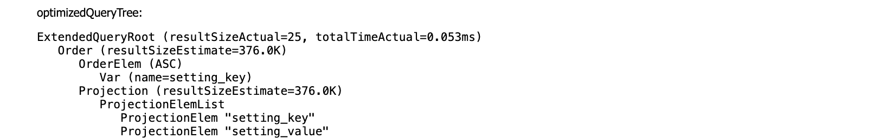

# JMX Console

## Get started

The JMX management console can be accessed at the following url
`<Application_Server_Address>/rdf4j-server/management/`

Halyard-specific MBeans can be found under the domain **com.msd.gin.halyard**.

### MBeans

#### HBaseSailMXBean

Management bean for [HBaseSail](../../sail/src/main/java/com/msd/gin/halyard/sail/HBaseSail.java).

Every active repository will have one of these, as will every active HBaseFederatedService.

For instance, the following JMX object names

```
type=com.msd.gin.halyard.sail.HBaseSail,id=1bce0f03,table=mydata,federatedServiceResolver=471560dc
type=com.msd.gin.halyard.sail.HBaseSail,id=6a3e78a2,owner=471560dc,table=otherdata,federatedServiceResolver=325ac1b6
```

indicate that the first MBean is the Sail used by the Repository for the table `mydata`,
and the second MBean is the Sail used by the HBaseFederatedService associated to the first (`owner` points to the first's
`federatedServiceResolver`) when performing SERVICE calls to the table `otherdata`.


##### Attributes

###### ConnectionCount (int)
The number of active connections.

###### EvaluationTimeout (int)
Timeout in seconds for each query evaluation, negative values mean no timeout.

###### PushStrategyEnabled (boolean)
Boolean option to use [HalyardEvaluationStrategy](../../strategy/src/main/java/com/msd/gin/halyard/strategy/HalyardEvaluationStrategy.java)
instead of org.eclipse.rdf4j.query.algebra.evaluation.impl.StrictEvaluationStrategy.

###### RecentQueries
Sorted oldest start time first. Only the last ten queries are available.

**running**

If the query is running or has finished.

**startTimestamp**

When the query was started.

**endTimestamp**

When the query completed.

**connectionId**

Each query has a connection ID. 
This is useful if you want to kill a query by using
the operation [killConnection](#killConnection).

The connection ID can be used to link a query to its [HalyardEvaluationExecutor](#HalyardEvaluationExecutor) as well.

**queryString**

The query that was executed.

**queryTree**

The QueryModelNode tree before optimisation.

**optimizedQueryTree**

The QueryModelNode tree after optimisation.



* resultSizeEstimate - estimate of how many results the node will return based on the stats stored at the time of optimization.
It also takes into account what bindings will be available at that point in the query.

* resultSizeActual - the true number of results returned.
Requires [trackResultSize](#TrackResultSize) to be true, and to track at all nodes (rather than just branch nodes), [trackBranchOperatorsOnly](#TrackBranchOperatorsOnly) to be false.

* totalTimeActual - time taken in executing the node.
Requires [trackResultTime](#TrackResultTime) to be true, and to track at all nodes (rather than just branch nodes), [trackBranchOperatorsOnly](#TrackBranchOperatorsOnly) to be false.

* costEstimate - cost of executing the node.

A query plan is executed:
* Top down
* For Joins, left node then right node.

###### ScanSettings
###### SearchConnectionPoolStats
###### SearchNodes
###### SearchSettings
Optional ElasticSearch settings.

###### SnapshotName
###### TableName
HBase table name used to store the data.

###### TrackBranchOperatorsOnly
If enabled, only do result size and time tracking for branch nodes.

Changing this will affect future queries, not currently running ones.

There is a performance penalty for disabling this.

###### TrackResultSize
###### TrackResultTime
###### ValueIdentifierAlgorithm
###### ValueIdentifierSize

##### Operations

###### clearQueryCache

###### clearStatisticsCache

###### killConnection
By passing the id of a connection you are able to kill the running query. These are found on a query in the recentQueries section.

#### HalyardEvaluationExecutor

Management bean for [HalyardEvaluationExecutor](../../strategy/src/main/java/com/msd/gin/halyard/strategy/HalyardEvaluationExecutor.java).

The connection ID can be used to link this back to a query in recentQueries.

##### Attributes

###### AsyncPullPushLimit
###### IncomingBindingsRateTracker
The number of binding sets per second being feed into the query from HBase reads.

###### MaxQueueSize
###### OutgoingBindingsRateTracker
The number of binding sets per second being produced by the query.

###### QueuePollTimeoutMillis
###### ThreadPoolExecutor

#### TrackingThreadPoolExecutor

Management bean for [TrackingThreadPoolExecutor](../../strategy/src/main/java/com/msd/gin/halyard/strategy/TrackingThreadPoolExecutor.java).

##### Attributes

###### ActiveCount
###### CompletedTaskCount
###### CorePoolSize
###### LargestPoolSize
###### MaximumPoolSize
###### PoolSize
###### QueueDump
###### QueueSize
###### TaskCount
###### ThreadDump


## Debugging query performance

If the node ordering doesn't look sensible the first thing to check is that the stored stats are sensible.

Link to [stats docs](../../docs/tools.md#Halyard Stats).

