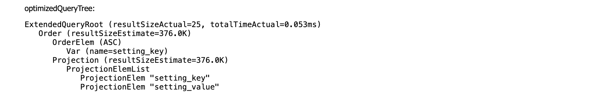

# JMX Console

## Get started

The JMX management console can be accessed at the following url
`<Application_Server_Address>/rdf4j-server/management/`

## Domains

### Catalina
### JMImplementation
### Users

### com.msd.gin.halyard

#### HBaseSail
[HBaseSail Class](../../sail/src/main/java/com/msd/gin/halyard/sail/HBaseSail.java)

A list of open connections to a repository. These can be though of as query engines for a given repository

```
type=com.msd.gin.halyard.sail.HBaseSail,
id=1bce0f03,
owner=6a3e78a2 # Displayed only for service calls
table=project-config,
federatedServiceResolver=471560dc
```

Service calls also have their own connections. Anything that has an `owner` means that it is part of a service call

A service call can be linked back to the query it is contained in by tracking the `owner` to a parents `federatedServiceResolver`,
this is a tree structure

Each connection has a number of attributes and operations

##### Attributes

###### ConnectionCount
The number of active connections

###### EvaluationTimeout
int timeout in seconds for each query evaluation, negative values mean no timeout

###### PushStrategyEnabled
boolean option to use [HalyardEvaluationStrategy](../../sail/src/main/java/com/msd/gin/halyard/strategy/HalyardEvaluationStrategy.java)
instead of org.eclipse.rdf4j.query.algebra.evaluation.impl.StrictEvaluationStrategy

###### RecentQueries
Sorted oldest start time first

**running**

If the query is running or has finished

**startTimestamp**

When the query was started

**endTimestamp**

When the query completed

**connectionId**

Each query has a connectionID. 
This is useful if you want to kill your query by using [the operation killConnection](#killConnection)

The connectionId can be used to link this to a [HalyardEvaluationExecutor](#HalyardEvaluationExecutor) as well

**queryString**

The query that was executed before the optimizer

**queryTree**

The above query displayed as its nodes

Each part of a query will map to a query node:
* SELECT is a Projection
* ORDER BY to Order

Some might have different names as they are named after the algebra in the Sparql specification

Every node has a child node plus property or attribute nodes, an order by for example acts on a child.
Informational nodes come first and the node it acts on comes second

**optimizedQueryTree**

The query tree from the query above after the optimizer has taken into account stats, known values etc. into what it thinks if the optimal order of execution



* resultSizeEstimate - this is an estimate on how many results the Node will return based on the stats stored at the time of optimization.
It also takes into account what it will know at that node in the query

* resultSizeActual - The true number of results returned. It will only track at certiain nodes
To track at all nodes you can set [TrackBranchOperatorsOnly](# TrackBranchOperatorsOnly)

* totalTimeActual - The time taken in executing the node

* costEstimate - 

A query plan is executed:
* Top down
* Left join node then the Right join node
  * For every result of the Left join it will execute the Right join
  * As with other query language we should try and keep the left join small

###### ScanSettings
###### SearchConnectionPoolStats
###### SearchNodes
###### SearchSettings
optional ElasticSearch settings

###### SnapshotName
###### TableName
HBase table name used to store data

###### TrackBranchOperatorsOnly
This will give resultSizeActual for all nodes in a query's execution.

Changing this will affect future queries, not currently running ones.

There is a performance penalty enabling this

###### TrackResultSize
###### TrackResultTime
###### ValueIdentifierAlgorithm
###### ValueIdentifierSize

##### Operations

###### clearQueryCache

###### clearStatisticsCache

###### killConnection
By passing the id of a connection you are able to kill the running query. These are found on a query in the resentQueries section

#### HalyardEvaluationExecutor
[HalyardEvaluationExecutor Class](../../strategy/src/main/java/com/msd/gin/halyard/strategy/HalyardEvaluationExecutor.java)

The connectionId can be used to link this back to a single query in the recentQueries

##### Attributes

###### AsyncPullPushLimit
###### IncomingBindingsRateTracker
How fast the executor is reading from HBase

###### MaxQueueSize
###### OutgoingBindingsRateTracker
How fast the results are being produced at the top of the plan

###### QueuePollTimeoutMillis
###### ThreadPoolExecutor

#### TrackingThreadPoolExecutor
[TrackingThreadPoolExecutor Class](../../strategy/src/main/java/com/msd/gin/halyard/strategy/TrackingThreadPoolExecutor.java)

##### Attributes

###### ActiveCount
###### CompletedTaskCount
###### CorePoolSize
###### LargestPoolSize
###### MaximumPoolSize
###### PoolSize
###### QueueDump
###### QueueSize
###### TaskCount
###### ThreadDump

If a lot of your threads are waiting (`TIMED_WAITING`) that is bad 

### com.sun.management
### java.lang
### java.nio
### java.util.logging
### jdk.management.jfr
### org.apache.logging.log4j2


## Debugging query performance

If the ordering doesn't look sensible the first thing to check is that the stored stats are sensible

Link to [stats docs](../../docs/tools.md#Halyard Stats)